<div align="center">

# 🎨 2D Assets Pipeline

### Turn one game-UI screenshot into a library of clean, reusable Unity sprites.

*A local-first workbench that finds every element on a mockup, cuts it out at pixel fidelity,
lifts the lettering off it, and lands it in your Unity project as a sprite atlas — without
redrawing a single thing it didn't have to.*

<br/>

[](https://github.com/AdielMag/2d-assets-pipeline/actions/workflows/ci.yml)
[](https://codecov.io/gh/AdielMag/2d-assets-pipeline)
[](server/tests)
[](codecov.yml)

<br/>

[](https://python.org)
[](https://fastapi.tiangolo.com)
[](https://sqlalchemy.org)
[](https://react.dev)
[](https://typescriptlang.org)
[](https://vite.dev)
[](https://sqlite.org)
[](https://unity.com)
[](server/requirements-ml.txt)

</div>

---

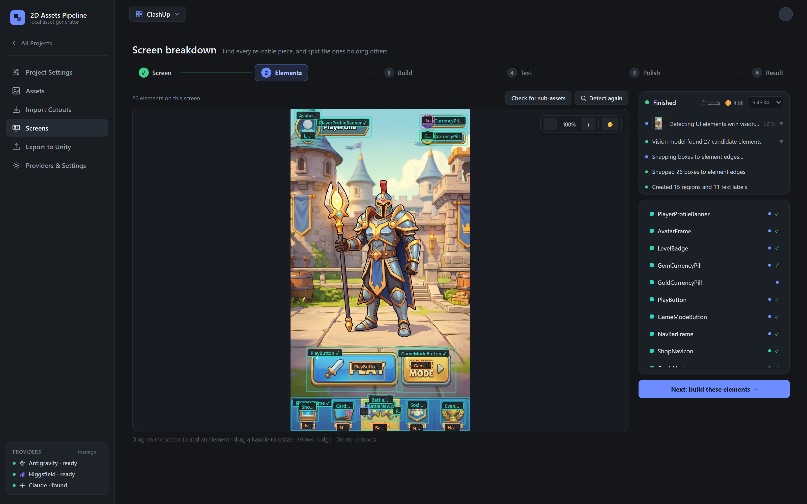

---

## 📖 Table of contents

| | |
|---|---|
| [🎯 What it does](#-what-it-does) | The core idea, in one diagram |
| [✨ What we have](#-what-we-have) | Feature inventory + repo stats |
| [🚀 How to run it](#-how-to-run-it) | Setup, dev servers, providers |
| [🏗️ Architecture](#️-architecture) | Tech stack and how the pieces talk |
| [🔄 The six-step screen pipeline](#-the-six-step-screen-pipeline) | Screenshot → Unity, step by step |
| [🔬 How extraction actually works](#-how-extraction-actually-works) | The part that makes it worth it |
| [🗃️ Data model](#️-data-model) | Tables and relationships |
| [📁 Storage layout](#-storage-layout) | Where every file lives on disk |
| [🎮 Unity integration](#-unity-integration) | Atlases, 9-slice, screen prefabs |
| [🧪 Tests, coverage & CI](#-tests-coverage--ci) | What runs on every PR |
| [🤝 Contributing](#-contributing) | Branch protection & merge rules |

---

## 🎯 What it does

You give it a screenshot of a game screen. It gives you back every button, frame, icon and
bar on that screen as an individual transparent PNG, organised into domains, imported into
Unity as sprite atlases with the right 9-slice borders.

**The inversion the whole project is built around:** a screenshot *already contains* the
exact pixels of every element on it. So for anything not occluded, the pipeline **segments**
rather than **regenerates** — which gives 100% colour and shape fidelity, for free, offline.
Image models are the fallback for the cases segmentation can't reach (an element buried under
three other things), not the default.

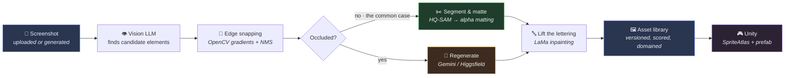

### Why not just generate everything?

| | Extract (segment from the screenshot) | Generate (ask an image model) |
|---|---|---|
| **Colour fidelity** | Exact — they are the original pixels | Drifts in hue and saturation |
| **Shape fidelity** | Exact | Plausible lookalike, wrong proportions |
| **Cost** | Free, offline | Burns provider quota / credits |
| **Speed** | Seconds | 10s–minutes per image |
| **Works when** | The element is visible | Always |
| **Used for** | The default path | Heavily occluded elements only |

Both paths land in the same versioned asset, so an extracted `v2` can be compared against a
generated `v1` of the same element using the built-in [fidelity scores](#-tests-coverage--ci).

---

## ✨ What we have

<table>
<tr><td width="50%" valign="top">

**🖼️ Asset library**
- Domain tree (self-referential atlases), each domain maps 1:1 to a Unity `SpriteAtlas`
- Full version history per asset — every generation kept, any one selectable
- Per-asset prompt, aspect ratio, resolution, PPU, 9-slice borders
- Reference images at project *and* asset level
- Trim to content · Upscale 2× · Downscale 0.5× (re-derived from the pristine raw, never a blurry resize)
- Built-in image editor + 9-slice editor with live tile preview

</td><td width="50%" valign="top">

**🔍 Screen breakdown**
- Vision-LLM element detection with per-edge gradient snapping and NMS
- Sub-asset splitting (a nav bar → its five icons)
- Shared-background grouping (gem/gold pills share one frame + separate icons)
- Mirror detection (a `next`/`prev` arrow pair reuses one sprite, flipped)
- Reuse approval — matches new elements against assets already in the domain
- Live SSE progress with intermediate images

</td></tr>
<tr><td valign="top">

**🎨 Generation providers**
- **Antigravity** — Google AI Pro/Ultra subscription, no per-image billing
- **Higgsfield** — official CLI against your own plan
- **Gemini** — direct Generative Language REST API (needs a key)
- Per-provider enable toggles that hard-block spend server-side
- Live cost estimation before you press the button
- Magenta chroma-key removal for providers without native alpha

</td><td valign="top">

**🎮 Unity export**
- One `SpriteAtlas` per domain, built automatically
- `.import.json` sidecars + an auto-installed `AssetPipelineImporter.cs`
- Per-domain export path overrides under `Assets/Sprites/`
- Point/bilinear filtering, clamp/repeat wrap, power-of-two padding
- Screen prefab builder — rebuilds the whole screen from its sprites
- Text stays *data*, re-rendered by Unity with a real font (localisable)

</td></tr>
</table>

### Repo at a glance

| Area | Contents | Lines |
|---|---|---:|
| `server/app/` + `server/tools/` | FastAPI app, 10 routers, 12 image-processing modules, 4 providers, 13 CLI tools | **17,225** |
| `client/src/` | React 19 SPA — 7 pages, 6-step screen wizard, 8 shared components | **11,073** |
| `server/tests/` | 73 pytest tests over the processing algorithms | **1,418** |
| `unity/Editor/` | Importer, atlas builder, screen layout builder | **566** |
| `unity-clashup/` | Demo Unity project with 60 exported sprites across 6 atlases | — |

---

## 🚀 How to run it

### Prerequisites

| | Needed for |
|---|---|
| **Python 3.10+** | The FastAPI server |
| **Node 20+** | The Vite client |
| **Unity 2022.3+** | Only if you want to export (the pipeline runs fine without it) |
| *Optional:* an NVIDIA GPU | Local SAM2 / LaMa / Real-ESRGAN models — everything degrades to classical fallbacks without one |

### 1 · Install

```bash
git clone https://github.com/AdielMag/2d-assets-pipeline.git
cd 2d-assets-pipeline
```

**Server:**

```bash
python -m venv server/.venv
server/.venv/Scripts/activate
pip install -r server/requirements.txt
```

**Client:**

```bash
npm --prefix client install
```

### 2 · Configure providers

```bash
cp server/.env.example server/.env
```

Everything in `.env` is optional — the app boots with no keys at all, it just can't generate
images until at least one provider is set up. **Extraction never needs a provider.**

| Provider | Setup | Cost |
|---|---|---|
| **Antigravity** | Install the Antigravity CLI, sign in with Google | Free on an AI Pro/Ultra plan |
| **Higgsfield** | `npm i -g @higgsfield/cli` then `higgsfield auth login` | Uses your plan's credits |
| **Gemini** | Set `GEMINI_API_KEY` in `server/.env` | Per-request API billing |
| **Claude / Antigravity (text)** | The CLI on your `PATH` | Free on your existing login |

Text LLMs drive prompt refinement and vision region-detection. Providers can be toggled off
in the UI — the server then *refuses* to generate with them, so a disabled provider can never
spend money.

### 3 · Optional: the local ML models

Extraction quality is meaningfully better with these, but the pipeline works without them:

```bash
pip install torch torchvision --index-url https://download.pytorch.org/whl/cu124
pip install --no-deps sam2 simple-lama-inpainting
pip install -r server/requirements-ml.txt
```

> **Note** the `--no-deps` on `sam2`: its dependency set pulls `opencv-python`, which collides
> with the `opencv-python-headless` in the base requirements over the same `cv2` module.

### 4 · Run

**One command (Windows):**

```bash
./start-dev.ps1
```

**Or manually, in two terminals:**

```bash
python -m uvicorn app.main:app --port 8787 --app-dir server
```

```bash
npm --prefix client run dev
```

| | URL |
|---|---|
| 🖥️ **Client** | http://localhost:5173 |
| ⚙️ **API** | http://localhost:8787 |
| 📚 **API docs** | http://localhost:8787/docs |

> Uvicorn runs **without** `--reload` — restart it after changing server code.

---

## 🏗️ Architecture

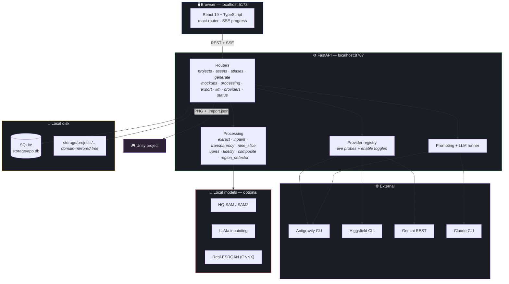

### Stack

| Layer | Choice | Why |
|---|---|---|
| **API** | FastAPI + Uvicorn | Async SSE streaming for long generation jobs |
| **ORM** | SQLAlchemy 2.0 (typed `Mapped[...]`) | Self-migrating on boot — see `main.py:_migrate` |
| **DB** | SQLite, single file | Local-first; the whole app is one folder you can zip |
| **UI** | React 19 + Vite 8 + TypeScript 6 | No component library — hand-rolled dark UI |
| **Imaging** | Pillow · NumPy · OpenCV · scikit-image · SciPy · PyMatting | The non-optional core; all classical, all offline |
| **Segmentation** | HQ-SAM (`vit_tiny`), GrabCut fallback | HQ-SAM's high-quality token fixes thin/hollow shapes |
| **Inpainting** | LaMa, classical fallback | Lifts icons and text off a frame |
| **Upscaling** | Real-ESRGAN via ONNX | Avoids the `basicsr` stack's old torch pin |
| **Lint** | oxlint | Fast; zero-config |

---

## 🔄 The six-step screen pipeline

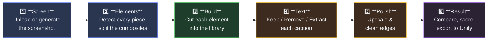

### 1 · Screen — pick or make the screen to break down

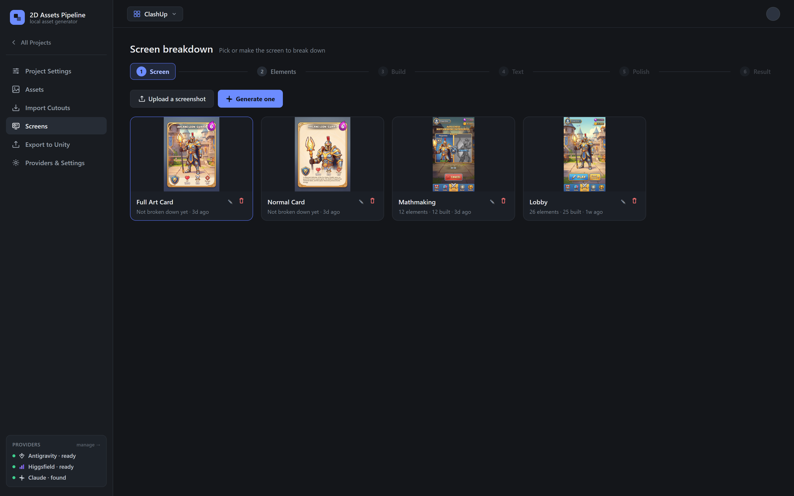

Upload a screenshot, or generate one from a prompt. Each screen tracks how many elements it
has and how many are built.

### 2 · Elements — find every reusable piece


A vision LLM proposes candidate boxes; OpenCV then snaps each **edge** independently to the
nearest strong gradient, and NMS drops the duplicates. On the lobby above that's 27 candidates
→ 26 snapped boxes → 15 regions + 11 text labels. Boxes are fully hand-editable — drag to add,
drag a handle to resize, arrows to nudge.

**Splitting** runs as the back half of detection rather than as its own step: "what are the
elements here" and "which of these hold others" are the same question at a different grain.

### 3 · Build — cut each element into the asset library

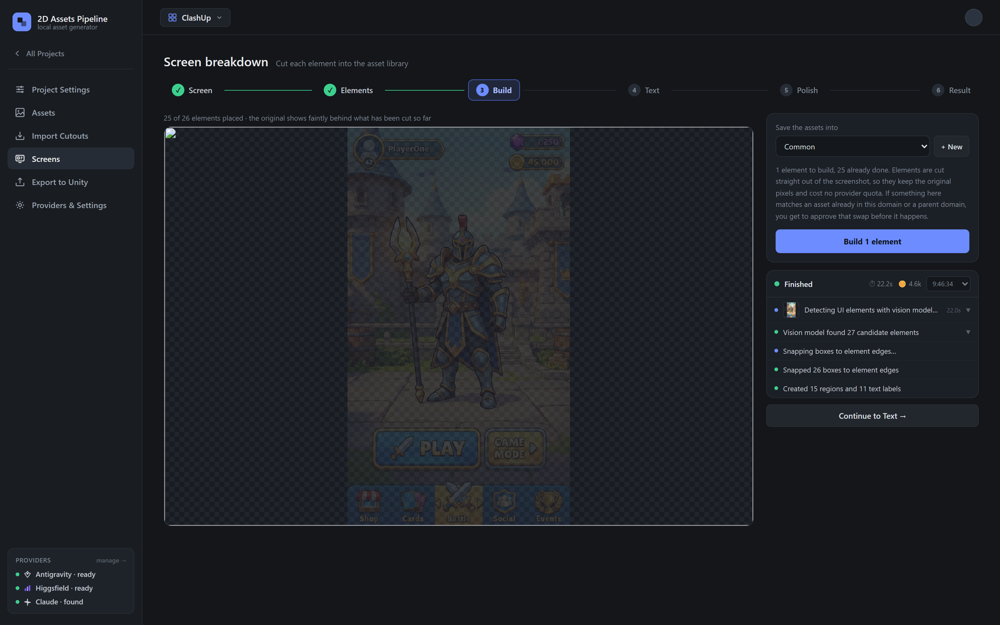

The original shows faintly behind what has been cut so far, so gaps are obvious. Elements are
segmented straight out of the screenshot — original pixels, no provider quota. Anything that
matches an asset already in this domain (or a parent domain) surfaces a **reuse approval**
before it's swapped in.

### 4 · Text — decide what happens to the lettering

Text is deliberately **not** baked into a sprite. A PLAY button with `PLAY` painted on can only
ever say PLAY, and the glyphs stretch when the frame is 9-sliced. Each caption gets its own
choice:

| Choice | What happens |
|---|---|
| **Keep** | Lettering stays baked in as drawn — free, no provider call |
| **Remove** | Inpainted off the frame; survives as a `MockupLabel` row for Unity to re-render with a real font |
| **Extract** | Inpainted off *and* redrawn as its own sprite, layered back over the parent |

### 5 · Polish — cosmetic upscale and edge cleanup

One element or all of them, through Real-ESRGAN plus an LLM-guided touch-up pass.

### 6 · Result — compare, score and export

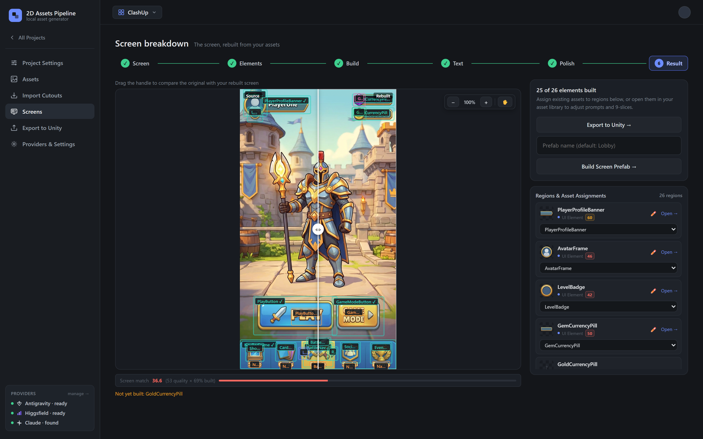

A drag-handle wipe between the original screenshot and the screen rebuilt purely from your
extracted sprites, with a **screen match score** underneath (quality × completeness). Then
either export the sprites or have it build the whole screen as a Unity prefab.

---

## 🔬 How extraction actually works

Three stages, and the order matters more than any of them individually.

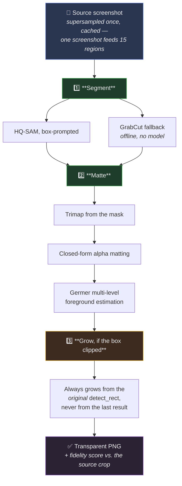

**Why HQ-SAM leads.** It is measurably better on the case that defines this problem — a small
element drawn *on* a large flat one. GrabCut's definite-foreground seed is an inset *rectangle*,
so on a narrow diagonal object that seed is mostly the frame underneath; its colour model learns
the frame, and the frame comes back inside the mask. Concretely: the PLAY button's sword
segments at **48% coverage carrying a slab of blue** under GrabCut, against HQ-SAM's **29.5% of
sword and nothing else**.

**Why background samples come from *outside* the box.** A detected region box is a *tight* bound,
so the element's own border sits right at the box edge. Seeding any part of the box interior as
background teaches the segmenter that the border is background — and it cuts the frame off,
leaving a PLAY button with no gold bevel.

**Why the grow stage anchors to the original rect.** Extraction may widen a box that was clipping
its element. If it grew from the *last grown result*, every rebuild would grow the already-grown
box again, and boxes would creep outward until they swallowed their neighbours.

### De-occlusion

An element in a screenshot arrives with whatever sat on top of it baked in — the PLAY button
comes with its sword, the nav bar with its five icons, the profile banner with the avatar
capping its end. Faithful, but not *reusable*. `processing/inpaint.py` masks the occluders and
LaMa fills what was underneath, so the frame comes out empty and ready to be filled with
anything.

---

## 🗃️ Data model

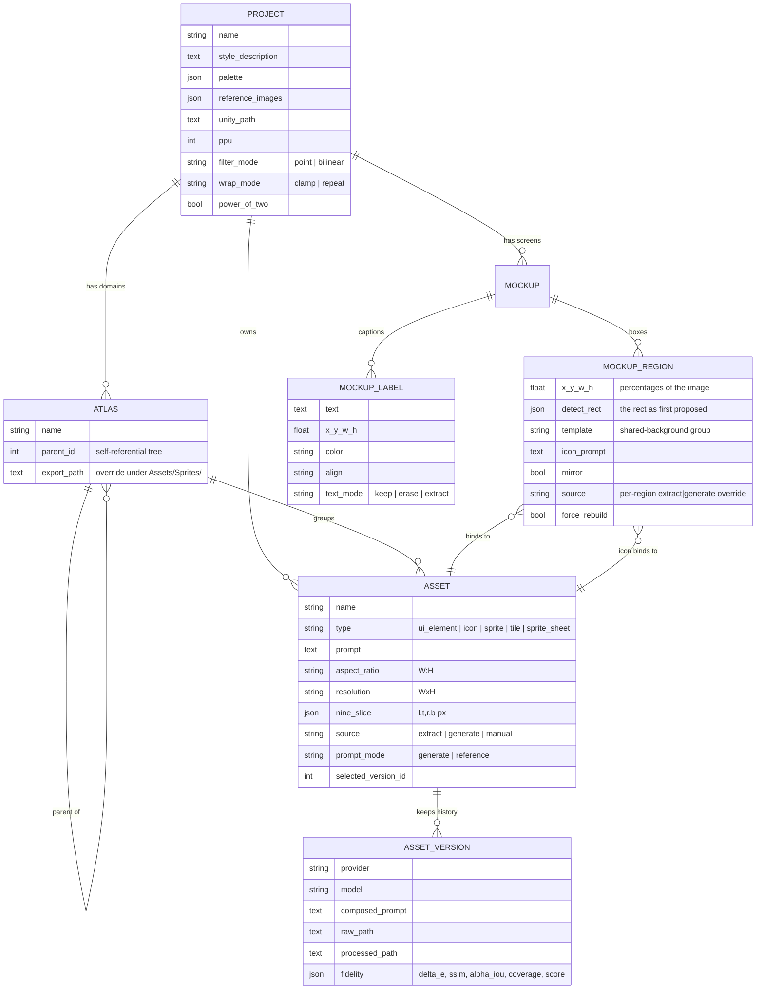

A few decisions worth knowing:

- **`fidelity` lives on the version, not the asset** — so an extracted `v2` can be scored
  against a generated `v1` of the same element.
- **`detect_rect` is preserved separately from the live box** — see the grow-stage note above.
- **`force_rebuild`** distinguishes "just unbound by a hand edit" from "never had an asset".
  Without it, build's reuse-by-name step matched a resized box straight back onto the very
  asset the edit was meant to replace.
- **Text is a row, not pixels** — `MockupLabel.text_mode` is per *caption*, not per element,
  because one nav bar carries several captions that don't all want the same fate.

---

## 📁 Storage layout

Files mirror the domain tree — one folder per asset, holding every file that asset owns.
Defined in `server/app/layout.py`.

```
storage/
├── app.db                                              SQLite, the whole database
└── projects/<pid>/
    ├── domains/<Domain>/<SubDomain>/<AssetName>/       every file that asset owns
    ├── domains/_unassigned/<AssetName>/                assets in no domain
    ├── mockups/<mockup_id>/                            screenshot + its crops
    ├── refs/                                           project style references
    ├── previews/, _work/                               throwaway, safe to sweep
    └── runs/                                           run logs (progress.py)
```

| Rule | |
|---|---|
| **Writing** | Always `storage.new_asset_path(db, asset, …)` — never `new_image_path` |
| **Deleting** | Deleting an asset / domain / mockup / project deletes its files |
| **Renaming** | Moves the files, via `layout.reconcile`, which recomputes the whole project and rewrites the DB paths |
| **Maintenance** | `python -m tools.migrate_storage` (dry run) · `--apply --prune` to sweep unreferenced files |
| **Verification** | `python -m tools.test_storage_layout` — end-to-end move/delete checks against a running server, on its own scratch project |

`storage/` is **gitignored** — it's ~1 GB of generated art and machine-specific paths.

---

## 🎮 Unity integration

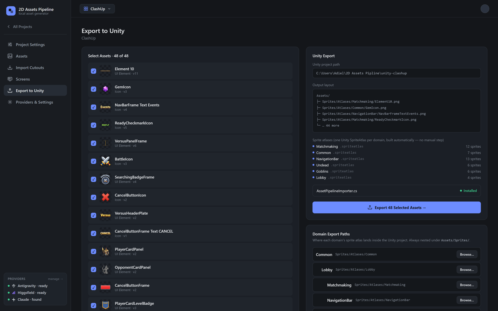

Export writes PNGs plus `.import.json` sidecars into your Unity project and installs
`AssetPipelineImporter.cs`, which applies the import settings inside the editor.


The demo project in `unity-clashup/` has **60 sprites across 6 atlases** (Common, Lobby,
Matchmaking, NavigationBar, Goblins, Undead) produced entirely by this pipeline.

### Asset detail — where per-sprite settings live

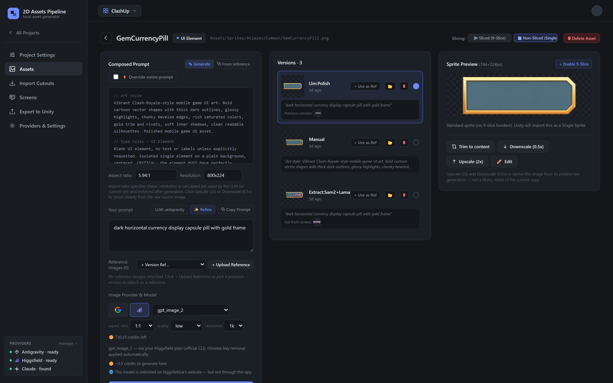

The composed prompt (art style + type rules + your prompt), the full version history with the
provider and model that made each one, and the sprite preview with trim / upscale / downscale /
9-slice controls.

### Project settings & providers

<table>
<tr>
<td width="50%">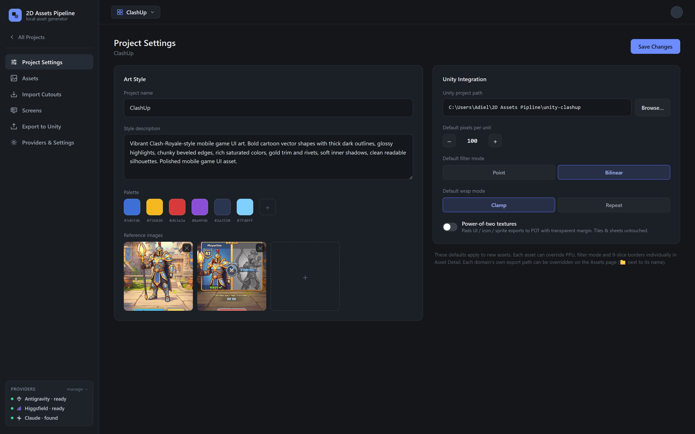</td>
<td width="50%">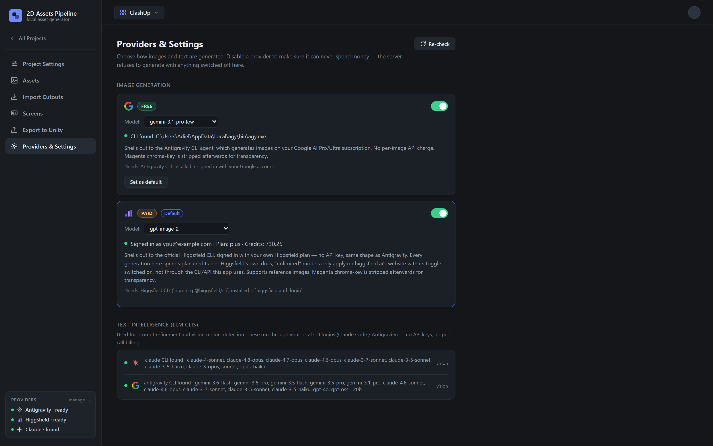</td>
</tr>
<tr>
<td><b>Project settings</b> — art style, palette, reference images, and the Unity defaults every new asset inherits.</td>
<td><b>Providers</b> — per-provider enable toggles. Switching one off makes the server refuse to generate with it, so it can never spend money.</td>
</tr>
</table>

---

## 🧪 Tests, coverage & CI

### Running the suite

```bash
python -m pytest tests --cov --cov-report=term --cov-report=html
```

Run it from `server/`. The 73 tests cover the image-processing algorithms — the part where a
regression is invisible until it ships. They deliberately run **without** the ML stack:
`app/ml.py` loads every model lazily and falls back to classical implementations, and the tests
assert on whichever backend answered.

### Where the coverage is

Coverage concentrates on the algorithms, which is the intent — the routers are thin HTTP
wrappers over these modules.

| Module | Coverage | |
|---|---:|---|
| `schemas.py` | 100% | ██████████ |
| `processing/fidelity.py` | 97% | █████████▊ |
| `processing/subdivide.py` | 95% | █████████▌ |
| `models.py` · `processing/reference.py` | 94% | █████████▍ |
| `processing/extract.py` | 79% | ███████▉ |
| `prompting.py` | 78% | ███████▊ |
| `processing/region_detector.py` | 77% | ███████▋ |
| `processing/nine_slice.py` | 76% | ███████▌ |
| `processing/composite.py` | 62% | ██████▏ |
| `processing/inpaint.py` | 55% | █████▌ |
| `routers/*` · `providers/*` | 0–46% | ▏ |
| **Total** | **32%** | ███▏ |

### The fidelity harness

Beyond unit tests, `tools/score_run.py` is the A/B instrument for pipeline changes. Every asset
originates from a rectangle on a screenshot; that crop is ground truth. The harness renders the
asset back into that rectangle exactly the way the compositor would — same 9-slice / contain /
stretch math, reused from `composite.py` rather than reimplemented — and measures ΔE, SSIM,
alpha IoU and coverage.

### What runs on every PR

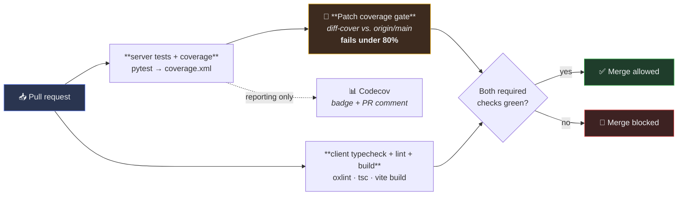

**The gate runs locally, not in a SaaS.** `diff-cover` reads `coverage.xml`, intersects it
with the diff against `origin/main`, and exits non-zero if the lines this PR added or
changed under `server/app` are less than **80%** covered. That failure takes down the
`server tests + coverage` check, which is a required status check — so the merge button
stays grey. No third-party service sits in the critical path, and the same command runs
locally:

```bash
pytest tests --cov --cov-report=xml && diff-cover coverage.xml --compare-branch=origin/main --fail-under=80
```

Run it from `server/`. `coverage.xml`'s paths are relative to `server/app` (see
[`server/.coveragerc`](server/.coveragerc)) and diff-cover resolves them against the working
directory — from the repo root it silently matches nothing and always "passes".

Configured in [`.github/workflows/ci.yml`](.github/workflows/ci.yml) and
[`codecov.yml`](codecov.yml).

> ### ⚠️ Codecov needs a token
>
> The badge at the top of this README and the `codecov/patch` · `codecov/project` statuses
> stay dark until Codecov is connected. Codecov **rejects tokenless uploads**, so:
>
> 1. Sign in at [codecov.io](https://codecov.io) with GitHub and add this repo
> 2. Copy the repository upload token
> 3. Add it as `CODECOV_TOKEN` under **Settings → Secrets and variables → Actions**
>
> The upload step is deliberately `continue-on-error` until then, so an unconfigured
> Codecov can't block every merge. Once the token is in place, flip `fail_ci_if_error` to
> `true` in the workflow and add the two Codecov contexts back as required checks:
>
> ```bash
> gh api -X PUT repos/AdielMag/2d-assets-pipeline/rulesets/20438319 --input .github/ruleset.json
> ```
>
> [`.github/ruleset.json`](.github/ruleset.json) is the branch protection kept in-repo, so
> the rules are reviewable rather than living only in the GitHub UI.

---

## 🤝 Contributing

`main` is protected. Direct pushes are rejected — everything goes through a pull request.

```bash
git checkout -b my-change
# ... work ...
git push -u origin my-change
gh pr create
```

**A PR merges only when:**

| Gate | Rule |
|---|---|
| ✅ `server tests + coverage` | 73 tests pass |
| ✅ `client typecheck + lint + build` | oxlint, `tsc -b`, `vite build` all clean |
| ✅ `codecov/patch` | **Lines this PR adds or changes are ≥ 80% covered** |
| ✅ `codecov/project` | Total coverage hasn't dropped more than 0.5% |
| ✅ Up to date | Branch is current with `main` |
| ✅ Conversations | All review threads resolved |

Approving reviews are **not** required — the repo is single-maintainer and GitHub does not
let you approve your own PR, so requiring one would make merging impossible. The status
checks are the gate. Force-pushes and branch deletion on `main` are blocked outright.

The patch gate is the one that matters day to day: the historical total sits near 32% because
the routers predate the test suite, and holding new work to that old average would just cement
it. New code carries its own tests.

---

<div align="center">

**Built for turning game-UI mockups into shippable Unity sprites — without redrawing them.**

</div>
