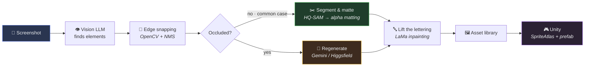
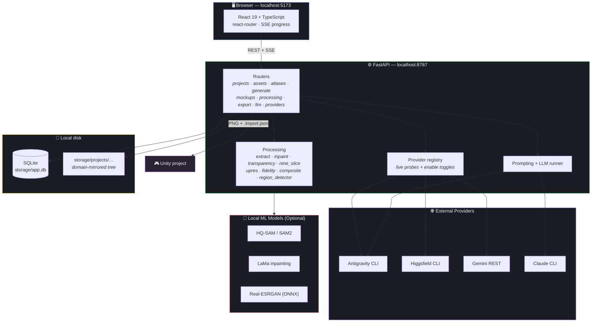
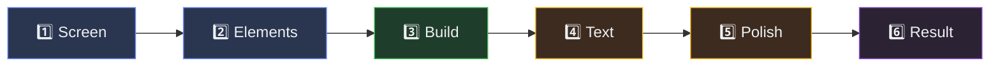
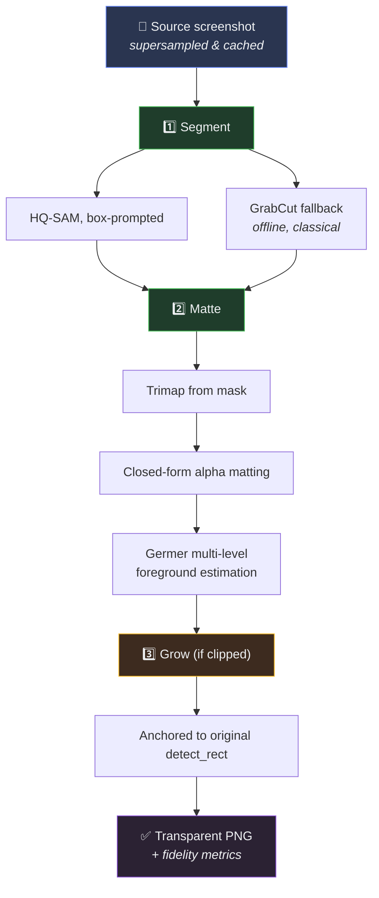
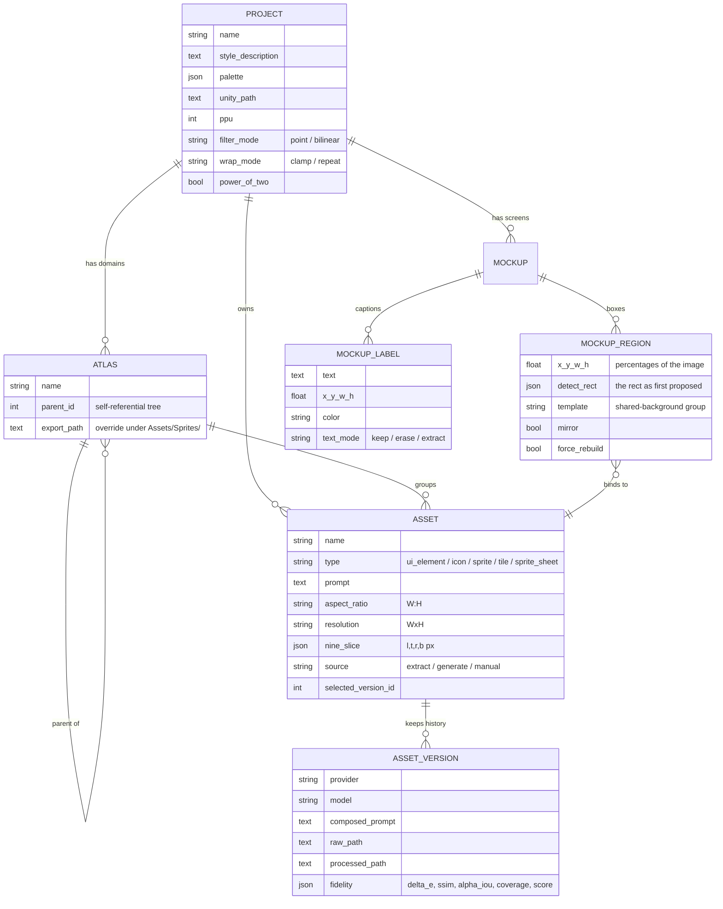
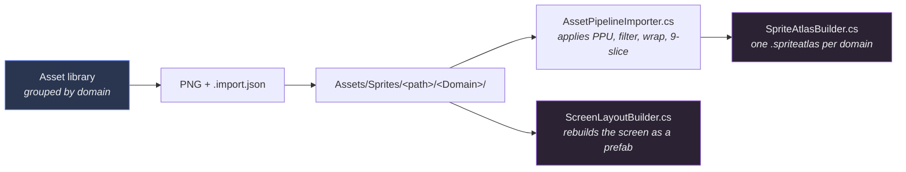
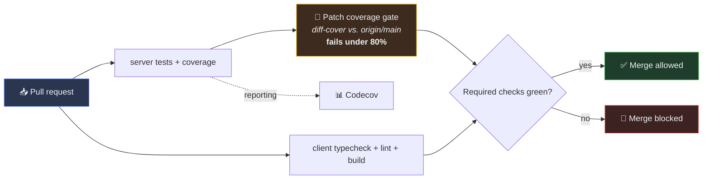

<div align="center">

# 🎨 2D Assets Pipeline

### Turn one game-UI screenshot into a library of clean, reusable Unity sprites.

<br/>

[](https://github.com/AdielMag/2d-assets-pipeline/actions/workflows/ci.yml)
[](https://codecov.io/gh/AdielMag/2d-assets-pipeline)
[](server/tests)
[](codecov.yml)

[](https://python.org)
[](https://fastapi.tiangolo.com)
[](https://react.dev)
[](https://typescriptlang.org)
[](https://vite.dev)
[](https://sqlite.org)
[](https://unity.com)

</div>


---

### Overview

Feed it a screenshot → get back every button, frame, and icon as a separate transparent PNG, automatically imported into Unity as a sprite atlas.

**Why extract instead of generate?** A screenshot already contains the exact pixels of every element on it. The pipeline cuts elements out instead of asking an AI model to redraw them — keeping extraction pixel-perfect, free, and completely offline. Generative AI models serve as an optional fallback for heavily occluded elements.

```bash
# 1. Install
python -m venv server/.venv && server/.venv/Scripts/activate
pip install -r server/requirements.txt
npm --prefix client install

# 2. Run (both servers)
./start-dev.ps1
```

Then open **http://localhost:5173**. No API keys are required to start — extraction runs offline without calling any cloud providers.

<details>
<summary><b>📖 Table of Contents</b></summary>

<br/>

| Section | Contents |
|---|---|
| [🎯 How It Works](#-how-it-works) | Core segmentation strategy & comparison |
| [✨ Core Features](#-core-features) | Feature inventory & repository stats |
| [🚀 Quick Start](#-quick-start) | Step-by-step setup and running |
| [🏗️ Architecture](#️-architecture) | System diagram & tech stack details |
| [🔄 The 6-Step Pipeline](#-the-6-step-pipeline) | Breakdown workflow & visual guide |
| [🔬 Extraction Engine](#-extraction-engine) | HQ-SAM, alpha matting, and inpainting details |
| [🗃️ Data Model & Storage](#️-data-model--storage) | Schema ER diagram & disk directory structure |
| [🎮 Unity Integration](#-unity-integration) | SpriteAtlases, 9-slice, and prefab generation |
| [🧪 Testing & Quality Gates](#-testing--quality-gates) | Test suite and CI coverage enforcement |
| [🤝 Contributing](#-contributing) | Branch protection & merge requirements |

</details>

---

## 🎯 How It Works

By segmenting elements directly out of the screenshot rather than regenerating them, common extraction tasks are pixel-exact, free, and instant.



<details>
<summary><b>💡 Deep Dive: Why extract beats generate</b></summary>

<br/>

| Metric / Aspect | Extract (Cut from screenshot) | Generate (Image Model AI) |
|---|---|---|
| **Colour fidelity** | Exact — uses original pixels | Drifts in hue and saturation |
| **Shape fidelity** | Exact proportions | Plausible lookalike, wrong geometry |
| **Cost** | Free, offline | Burns provider quota / credits |
| **Speed** | Instant (seconds) | 10s–minutes per image |
| **Requirement** | Element is visible | None |
| **Primary Use** | Default path for UI elements | Heavily occluded elements only |

Both paths land in the same versioned asset system, allowing an extracted version to be scored directly against a generated version using built-in fidelity metrics.

</details>

---

## ✨ Core Features

- **🖼️ Asset Library**: Self-referential domain trees mapping 1:1 to Unity `SpriteAtlas` assets, complete version history, prompt tuning, non-destructive re-scaling, and interactive 9-slice editing.
- **🔍 Screen Breakdown Wizard**: Automatic Vision-LLM candidate detection, edge gradient snapping (OpenCV + NMS), sub-asset splitting, shared background grouping, and asset reuse matching.
- **🎨 Generation Providers**: Support for Antigravity (Google AI Pro/Ultra), Higgsfield CLI, and Gemini API with hard spend controls, pre-execution cost estimation, and automated chroma-keying.
- **🎮 Unity Export**: Automated `.spriteatlas` generation, `.import.json` sidecars, custom import scripts, 9-slice borders, and full screen prefab reconstruction.

<details>
<summary><b>📊 Repository Stats & Detailed Inventory</b></summary>

<br/>

### Repository at a Glance

| Area | Contents | Lines |
|---|---|---:|
| `server/app/` + `server/tools/` | FastAPI app, 10 routers, 12 image-processing modules, 4 providers, 13 CLI tools | **17,225** |
| `client/src/` | React 19 SPA — 7 pages, 6-step screen wizard, 8 shared components | **11,073** |
| `server/tests/` | 73 pytest tests over processing algorithms | **1,418** |
| `unity/Editor/` | Importer, atlas builder, screen layout builder | **566** |
| `unity-clashup/` | Demo Unity project with 60 exported sprites across 6 atlases | — |

<br/>

### Full Feature Breakdown

- **Asset Library**: Domain trees, version history per asset, custom prompts, aspect ratio, PPU, 9-slice controls, built-in image editor.
- **Screen Breakdown**: Vision-LLM element detection with per-edge snapping, sub-asset splitting, shared-background grouping, mirror detection (flipping symmetrical sprites), and live SSE progress.
- **Generation Providers**: Antigravity, Higgsfield, Gemini REST, per-provider spend-block toggles, live cost estimates, and magenta chroma-key removal.
- **Unity Export**: Automated `SpriteAtlas` creation, `.import.json` sidecars, point/bilinear filtering, clamp/repeat modes, power-of-two padding, and font-preserved text re-rendering.

</details>

---

## 🚀 Quick Start

### 1. Installation

```bash
git clone https://github.com/AdielMag/2d-assets-pipeline.git
cd 2d-assets-pipeline

# Server setup
python -m venv server/.venv
server/.venv/Scripts/activate  # On Windows
pip install -r server/requirements.txt

# Client setup
npm --prefix client install
```

### 2. Run the Application

```bash
# Windows launch script (starts server + client)
./start-dev.ps1
```

Access the UI at **http://localhost:5173** (API docs available at **http://localhost:8787/docs**).

<details>
<summary><b>⚙️ Provider Configuration & Optional Local ML Models</b></summary>

<br/>

### Environment & Providers Configuration

Copy `.env.example` to `server/.env`:
```bash
cp server/.env.example server/.env
```

Extraction requires zero keys. Optional generation provider credentials:
- **Antigravity**: Authenticated via Google AI Pro/Ultra login in the Antigravity CLI.
- **Higgsfield**: Configured via `@higgsfield/cli`.
- **Gemini**: Requires `GEMINI_API_KEY` set in `server/.env`.

Providers can be toggled on/off in the settings UI to prevent inadvertent API usage.

### Optional Local ML Acceleration

Installing PyTorch and local models improves extraction quality (falls back to classical algorithms if uninstalled):

```bash
pip install torch torchvision --index-url https://download.pytorch.org/whl/cu124
pip install --no-deps sam2 simple-lama-inpainting
pip install -r server/requirements-ml.txt
```

> **Note**: `--no-deps` on `sam2` prevents dependency conflicts with `opencv-python-headless`.

</details>

---

## 🏗️ Architecture



<details>
<summary><b>🛠️ Technology Stack Decisions & Rationale</b></summary>

<br/>

| Layer | Choice | Rationale |
|---|---|---|
| **API** | FastAPI + Uvicorn | Async SSE streaming for long generation tasks |
| **ORM** | SQLAlchemy 2.0 | Typed mappings (`Mapped[...]`), self-migrating schema |
| **Database** | SQLite | Zero-config, single-file local database |
| **Frontend** | React 19 + Vite 8 + TS | Hand-crafted modern dark-mode interface |
| **Core Imaging** | Pillow, OpenCV, NumPy, SciPy | Offline, deterministic processing primitives |
| **Segmentation** | HQ-SAM (`vit_tiny`), GrabCut | High-quality token preserves fine details and thin geometry |
| **Inpainting** | LaMa | Clean background restoration after lifting text/icons |
| **Upscaling** | Real-ESRGAN (ONNX) | Fast execution without heavy legacy dependencies |

</details>

---

## 🔄 The 6-Step Pipeline



| Step | Purpose |
|---|---|
| **1 · Screen** | Import or generate a screen mockup for analysis. |
| **2 · Elements** | Detect reusable UI elements and sub-components via Vision LLM + OpenCV. |
| **3 · Build** | Cut elements into assets, matching against existing domain items. |
| **4 · Text** | Choose whether to keep, erase, or extract text into re-renderable labels. |
| **5 · Polish** | Perform Real-ESRGAN upscaling and edge refitting. |
| **6 · Result** | Score reconstruction fidelity against the original screenshot and export to Unity. |

<details>
<summary><b>📸 Visual Step-by-Step Walkthrough</b></summary>

<br/>

### 1 · Screen — Select screen source


### 2 · Elements — Detect elements & snap bounding boxes

A vision LLM proposes bounding candidates; OpenCV snaps each edge to the nearest strong gradient. Hand-editable box boundaries allow interactive fine-tuning.

### 3 · Build — Extract components into the asset library

Interactive approval surfaces existing matching assets in the domain to prevent duplicates.

### 4 · Text — Handle text captions
Text is separated into data representations (`MockupLabel`) rather than hard-baking pixels into sprites, enabling clean localizable rendering in Unity.

### 5 · Polish — Cosmetic refinement
Runs Real-ESRGAN upscaling and edge anti-aliasing passes.

### 6 · Result — Compare score & export

Provides a live visual slider comparing the original mockup against the rebuilt screen, along with an automated fidelity score.

</details>

---

## 🔬 Extraction Engine

The core pipeline uses box-prompted **HQ-SAM**, followed by closed-form **alpha matting** and dynamic bounding box growth.

<details>
<summary><b>📐 Algorithmic Details & Implementation Notes</b></summary>

<br/>

### Segmentation & Matting Pipeline



### Key Technical Insights

- **HQ-SAM vs GrabCut**: HQ-SAM prevents background bleed on thin diagonal objects. Classical GrabCut seed boxes can accidentally capture background pixels inside narrow bounding boxes, leading to color corruption.
- **Exterior Background Sampling**: Background seeds are sampled from *outside* the detected bounding rectangle to prevent trimming natural element borders and bevels.
- **Anchored Grow Logic**: Box expansion anchors strictly to the original `detect_rect`, preventing iterative growth loops from swallowing neighboring UI elements.
- **De-occlusion Inpainting**: `processing/inpaint.py` masks foreground occluders and leverages LaMa inpainting to reconstruct clean background frames.

</details>

---

## 🗃️ Data Model & Storage

<details>
<summary><b>🔍 Database Schema (ER Diagram) & Disk Layout</b></summary>

<br/>

### Database ER Diagram



### Storage Directory Structure

Managed by `server/app/layout.py`:

```
storage/
├── app.db                                              # SQLite main database file
└── projects/<pid>/
    ├── domains/<Domain>/<SubDomain>/<AssetName>/       # Asset source and versions
    ├── domains/_unassigned/<AssetName>/                # Unassigned assets
    ├── mockups/<mockup_id>/                            # Original screenshots & crops
    ├── refs/                                           # Project style reference images
    ├── previews/, _work/                               # Temporary working files
    └── runs/                                           # Execution progress logs
```

- **File Management**: Paths are generated via `storage.new_asset_path()`. Asset updates trigger directory reconciliations (`layout.reconcile`).
- **Maintenance CLI**: `python -m tools.migrate_storage --apply --prune` cleans unreferenced storage artifacts.

</details>

---

## 🎮 Unity Integration

Exports raw PNG assets, `.import.json` sidecars, and automated Unity Editor C# scripts to streamline asset ingestion into Unity projects.



<details>
<summary><b>🖼️ Asset Detail UI & Unity Importer Screenshots</b></summary>

<br/>


Inspect composed prompts, version history, resolution parameters, PPU, and 9-slice borders directly in the editor interface.

<table>
<tr>
<td width="50%"></td>
<td width="50%"></td>
</tr>
<tr>
<td><b>Project Settings</b> — Global default settings for Unity import, PPU, and texture filtering.</td>
<td><b>Provider Controls</b> — Hard server-side toggles for API expenditure control.</td>
</tr>
</table>

</details>

---

## 🧪 Testing & Quality Gates

The test suite covers the image-processing core, validating algorithms without requiring live ML models or cloud API keys.

```bash
# Run test suite and measure coverage
cd server
pytest tests --cov --cov-report=term
```

<details>
<summary><b>📈 Coverage Breakdown & CI Patch Gate</b></summary>

<br/>

### Module Coverage Matrix

| Module | Coverage | Status |
|---|---:|---|
| `schemas.py` | 100% | ██████████ |
| `processing/fidelity.py` | 97% | █████████▊ |
| `processing/subdivide.py` | 95% | █████████▌ |
| `models.py` · `processing/reference.py` | 94% | █████████▍ |
| `processing/extract.py` | 79% | ███████▉ |
| `prompting.py` | 78% | ███████▊ |
| `processing/region_detector.py` | 77% | ███████▋ |
| `processing/nine_slice.py` | 76% | ███████▌ |
| `processing/composite.py` | 62% | ██████▏ |
| `processing/inpaint.py` | 55% | █████▌ |
| `routers/*` · `providers/*` | 0–46% | ▏ |
| **Total Core Engine** | **32%** | ███▏ |

### CI Workflow Gate



Every PR requires that newly added or modified lines in `server/app` maintain at least **80% patch test coverage**, enforced locally via `diff-cover`:

```bash
pytest tests --cov --cov-report=xml && diff-cover coverage.xml --compare-branch=origin/main --fail-under=80
```

</details>

---

## 🤝 Contributing

1. Create a feature branch: `git checkout -b feature/my-improvement`
2. Run local tests: `cd server && pytest tests`
3. Check code formatting: `npm --prefix client run lint`
4. Submit a pull request.

<details>
<summary><b>🔒 Branch Protection & Merge Policies</b></summary>

<br/>

| Gate | Policy |
|---|---|
| `server tests + coverage` | All unit tests pass & patch coverage ≥ 80% |
| `client typecheck + lint + build` | `oxlint`, `tsc -b`, and `vite build` must pass cleanly |
| `main` Branch Safety | Direct force-pushes and branch deletions are disabled |

</details>

---

<div align="center">

**Built for turning game-UI mockups into shippable Unity sprites — without redrawing them.**

</div>
